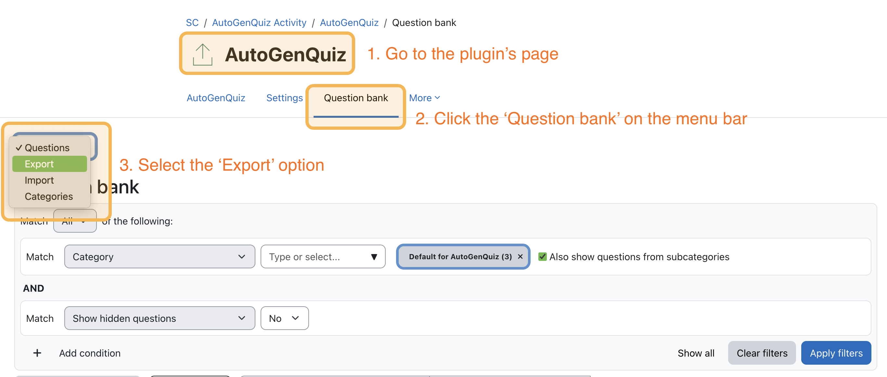
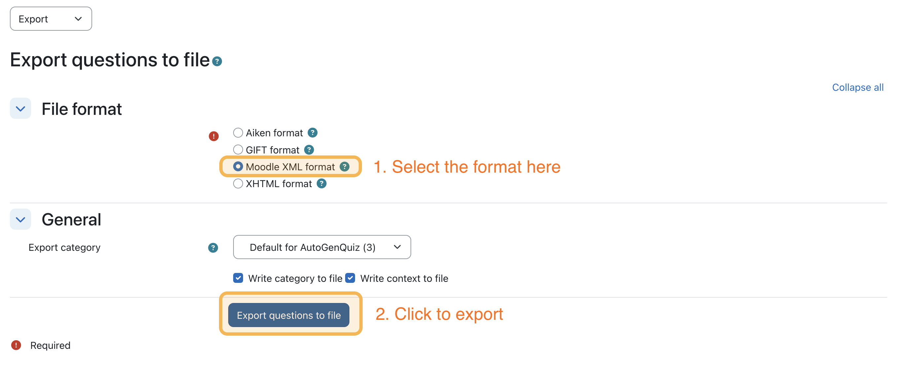
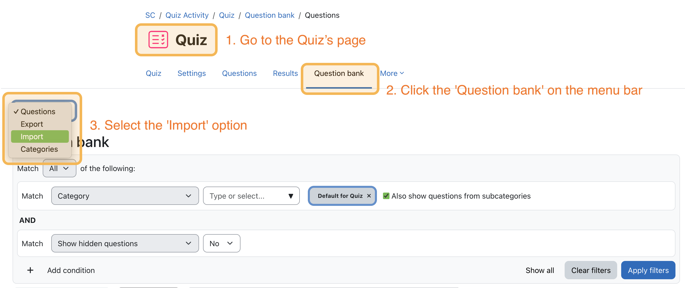
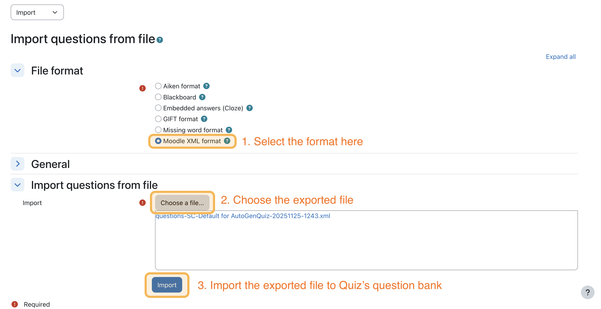
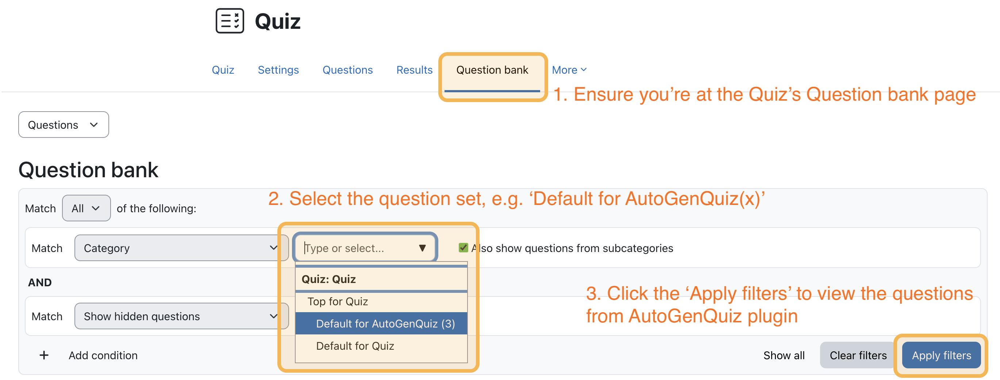

## 1. How to install this plugin
This plugin is **not published** on the official Moodle plugins directory. If you want to use it, please contact your institution’s Moodle administrator or IT department. They can install the plugin manually using the steps below:

1. Download the `.zip` file of the `autogenquiz` plugin and unzip it.
2. Make sure the folder name is exactly `autogenquiz`.
3. Move the `autogenquiz` folder into your Moodle `mod/` directory, for example: `[MOODLE_ROOT]/mod/autogenquiz` or `[MOODLE_ROOT]/public/mod/autogenquiz`).
4. Open a terminal and run composer install inside the plugin folder (unless the vendor/ folder is already included in the zip):
    ```bash
      cd /path-to-your-moodle-root/mod/autogenquiz
      composer install
    ```
5. Create a new file: 
    ```bash
    /path-to-your-moodle-root/mod/autogenquiz/config_local.php
    ```
6. Put the following content into `config_local.php` (replace `YOUR_LLM_IP_ADDRESS` with your LLM server IP):
    ```php
      <?php

      $AUTOGENQUIZ_API_URL = 'http://YOUR_LLM_IP_ADDRESS:11434/api/generate';
    ```
7. Log in to Moodle as an administrator. Moodle should detect the new plugin automatically and guide you through the **installation/upgrade** screens.

## 2. How to use this plugin
This plugin already provides clear instructions for uploading files and generating questions, so you can follow those steps without any problem.

### 2.1 How to use the generated questions in a Quiz
After you have saved questions into this plugin’s question bank, you can import them into a Quiz activity. Make sure your course already contains at least one ‘Quiz’ activity.

**Steps:**
1. Go to this plugin's page and click “Question bank” in the navigation bar. Then choose 'Export' (top-left menu).
  
2. Select 'Moodle XML format', then click “Export questions to file” to download the file. (You may try other formats if needed.)
  
3. Go to your Quiz activity and open its Question bank page. Choose 'Import' (top-left menu).
  
4. Again select 'Moodle XML format', upload the exported file, and click 'Import'.
  
5. The imported questions will appear immediately. If they don’t show up later, select the correct question category and click 'Apply filters' to display them again.
  

## 3. Project Issues & Development Notes
If you want to understand the development process or plan to build your own Moodle plugin, you can review the following links or browse the full [Issues](https://github.com/jrcz-data-science-lab/moodle-plugin-quiz-generator/issues) page.

[Resource list](https://github.com/jrcz-data-science-lab/moodle-plugin-quiz-generator/issues/1)\
[Moodle 5.0 database schema and project ERD](https://github.com/jrcz-data-science-lab/moodle-plugin-quiz-generator/issues/2)\
[Development Plan and DFD](https://github.com/jrcz-data-science-lab/moodle-plugin-quiz-generator/issues/3)\
[User Stories and Requirements](https://github.com/jrcz-data-science-lab/moodle-plugin-quiz-generator/issues/4)\
[High-fidelity prototype](https://github.com/jrcz-data-science-lab/moodle-plugin-quiz-generator/issues/7)\
[Designed Prompt](https://github.com/jrcz-data-science-lab/moodle-plugin-quiz-generator/issues/9)\
[Files Explanation](https://github.com/jrcz-data-science-lab/moodle-plugin-quiz-generator/issues/15)\
[Moodle 5 Limitation](https://github.com/jrcz-data-science-lab/moodle-plugin-quiz-generator/issues/18)
